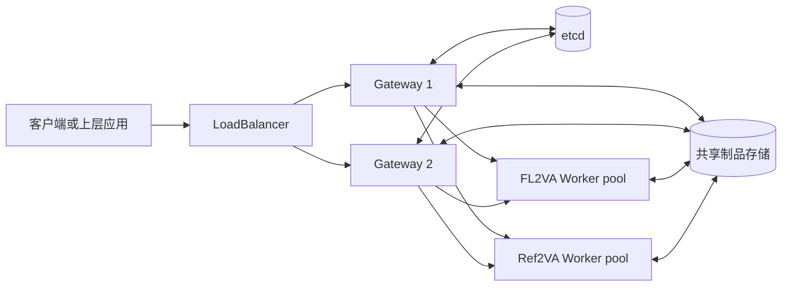

# Video Gateway

Dingo Video Gateway 是面向视频生成业务的持久化任务入口。它位于客户端与
vLLM-Omni Worker 之间，为耗时较长、结果文件较大的视频任务提供统一的提交、排队、
状态查询、取消、故障恢复和制品下载接口。

它不是模型推理引擎。模型执行仍由后端 Worker 完成；Gateway 负责把一次 HTTP 请求转换为
可持久化、可恢复、可观测的任务，并协调多个 Gateway 和多个 Worker 安全地处理同一套队列。

## 核心能力

- 同时提供异步任务接口和同步 MP4 返回接口，两种模式共用同一套任务生命周期。
- 使用 etcd 保存任务、队列、Worker lease、重试额度和 Gateway owner 信息，支持双 Gateway
  共同服务及故障接管。
- 使用共享制品存储保存上传素材和生成结果，使任一 Gateway 都能查询和下载已完成任务。
- 支持请求幂等，客户端可在连接中断或响应丢失后安全重试提交。
- 区分 Gateway 排队、Worker 预取等待、Worker 执行和 Gateway 后处理阶段。
- Worker 明确失联时可按策略重试；参数、媒体或模型错误不会被无差别重试。
- 支持取消、结果过期清理、HTTP Range、ETag 和 Prometheus 指标。
- 当前 MiniMax-H3 适配器支持 FL2VA 和 Ref2VA 两个独立的 Worker pool。

## 组件关系



etcd 保存协调状态，不保存视频内容。上传文件、中间任务目录和最终 MP4 位于共享制品存储。
多 Gateway 部署要求所有 Gateway 和 Worker 看到同一份制品目录。

## 任务生命周期

```text
queued -> in_progress -> completed
                      -> failed
       -> cancelled
```

公开 API 将内部的 `dispatching` 和 `finalizing` 都显示为 `in_progress`。因此
`in_progress` 可能表示正在下发、位于 Worker 预取队列、正在推理，或者 Gateway 正在发布
最终制品。具体阶段耗时可从单任务响应的 `metrics` 和 `stage_durations` 查看。

任务完成后结果不会永久保留。生命周期清理会把到期任务转为 `expired` 并释放制品空间；
对终态任务执行 DELETE 也会触发结果清理。

## 如何选择接口

- 业务系统通常应使用 `POST /v1/videos`：提交后保存任务 ID，通过状态接口轮询，完成后下载。
  该模式能容忍客户端断线、长时间推理和 Gateway 滚动重启。
- 命令行验证或调用方必须直接接收文件时，可使用 `POST /v1/videos/sync`。同步请求超时后
  任务不会消失，仍可使用响应头中的任务 ID 继续查询。
- 每次业务请求都建议提供稳定的 `Idempotency-Key`。重试同一请求时复用原 key，创建新任务
  时使用新 key。

完整的请求字段、媒体限制、curl 示例、响应结构和错误处理见
[接口使用说明](video-gateway-api.md)。

## 文档导航

| 文档 | 内容 | 面向对象 |
|---|---|---|
| [接口使用说明](video-gateway-api.md) | 模型查询、任务提交、状态、下载、取消、FL2VA/Ref2VA 输入和错误码 | 接口调用方、联调人员 |
| [协议与兼容性](video-gateway-protocol-compatibility.md) | 与 OpenAI Videos API、vLLM-Omni Videos API 的相同点和差异 | 接口调用方、适配开发人员 |
| [`CONTINUOUS_EXECUTION.md`](../../dingo/video_gateway/CONTINUOUS_EXECUTION.md) | Worker slot 提前释放、预取和连续执行的状态约束 | Gateway 开发与评审人员 |
| [`GATEWAY_CONFIGURATION_CONSISTENCY.md`](../../dingo/video_gateway/GATEWAY_CONFIGURATION_CONSISTENCY.md) | 双 Gateway 配置哪些必须一致、哪些可在滚动升级期间短暂不同 | 部署和运维人员 |

Kubernetes 部署 recipe 和回归测试维护在独立的
`dingo-video-gateway-regression` 项目中，接口文档不复制具体集群地址、PVC、节点或镜像配置。

## 当前边界

- Gateway 当前不实现最终用户认证、租户鉴权和业务配额；这些能力由上层应用或入口网关负责。
- `/ready` 表示 Gateway、任务存储和制品存储可用，不代表每个模型都有已注册 Worker。
  模型可用性应查询 `/v1/models` 中的 `available` 字段。
- `available=true` 表示至少发现一个 Worker，不表示存在空闲执行名额；满载时任务会排队，
  队列达到上限时返回 `429 queue_full`。
- 当前不提供逐去噪步的稳定进度百分比；`progress` 仅在完成时为 100，其他状态为 0。
- `POST /v1/videos/stream` 尚未实现。

实现入口位于 `dingo/video_gateway/`，主要模块包括 `api.py`、`service.py`、`dispatcher.py`、
`task_store.py`、`artifact_store.py` 和 `adapters/minimax_h3.py`。
